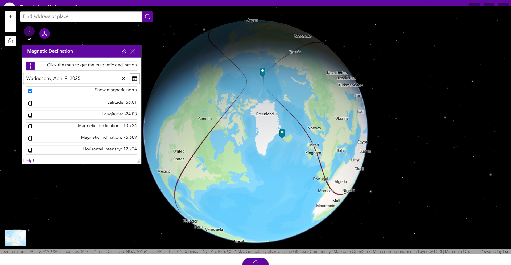

# Magnetic Declination Widget

## Description

This widget lets you compute the magnetic declination information based on the World Magnetic Model covering the period 2025-2030.

The world magnetic field varies every month. This widget also displays the predicted value for the north magnetic pole every year between 2025 and 2030.

## Features

* Display magnetic north pole for a given year.
* Display the magnetic declination for  a specific date. By default, the current date will be used.
* Display the magnetic declination either based on the current mouse location, or a marker on the map.

Each piece of information can be copied using the copy button on the left of each field.

# Future to-do

* Watch when esri date-picker component allow to define a date range. That would make the experience easier.

## Information about magnetic declination

More information can be found on [NOAA](https://www.ncei.noaa.gov/products/world-magnetic-model).

The underlying library allows for the computation of:

* F: Total Intensity of the geomagnetic field
* H: Horizontal Intensity of the geomagnetic field
* X: North Component of the geomagnetic field
* Y: East Component of the geomagnetic field
* Z: Vertical Component of the geomagnetic field
* I (DIP): Geomagnetic Inclination
* D (DEC): Geomagnetic Declination (Magnetic Variation)

F, X, Y, Z, and H are the intensities in nT of the geomagnetic fields - total magnitude, north-pointing component, east-pointing component, vertical component, and horizontal component, respectively.

Only the following components are exposed through the widget for now.

* D (DEC): Geomagnetic Declination (Magnetic Variation). It is expressed as the angle in degrees between the magnetic north and the true north in the horizontal plane. Positive values correspond to magnetic north pointing eastward from true north.
* I (DIP): Geomagnetic Inclination is the angle in degrees of the magnetic field lines with respect to the horizontal plane. Positive values correspond to the field pointing downward.
* H: Horizontal Intensity of the geomagnetic field

Thanks to [GeomagJS](https://github.com/janrg/geomag/blob/master/README.md) for the extra explanations

Values can be copied using the copy button on the left of each value.

# References

Information about magnetic north: https://www.ncei.noaa.gov/products/wandering-geomagnetic-poles

Really good documentation for Experience Builder components: https://developers.arcgis.com/experience-builder/storybook/?path=/docs/components-jimu-ui-basic-date-picker-datepicker--docs&args=selectedDate:!undefined

This widget uses `geomagnetism` to compute the declination: https://github.com/naturalatlas/geomagnetism